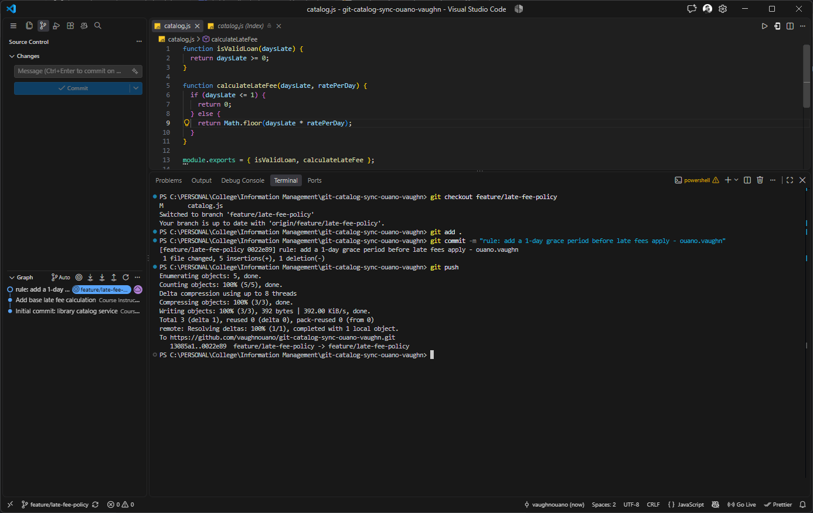
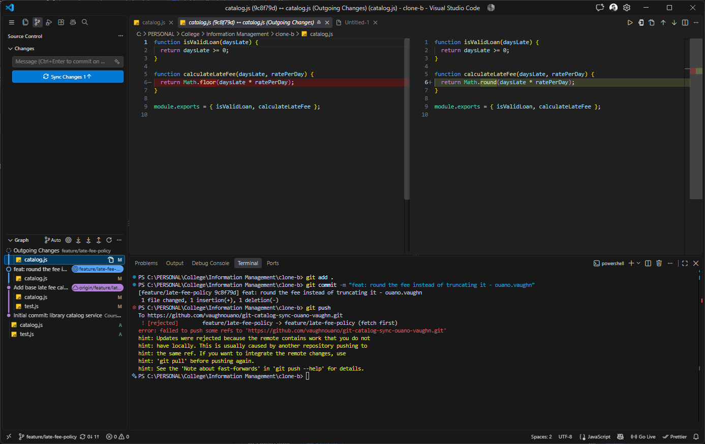
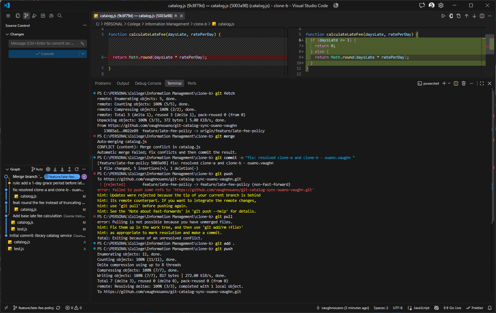
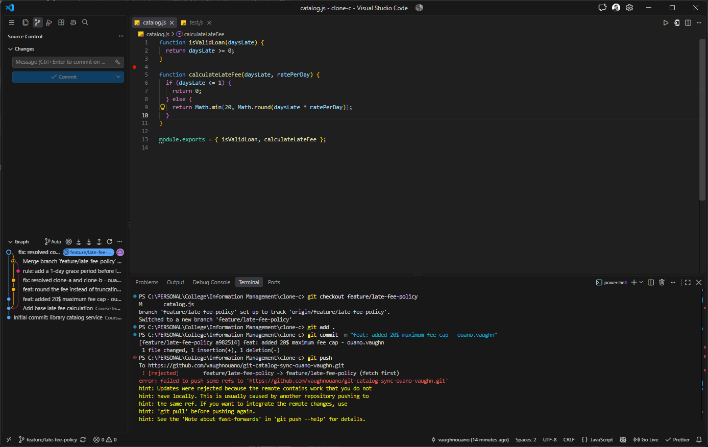
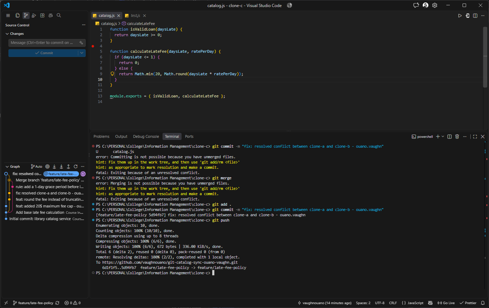
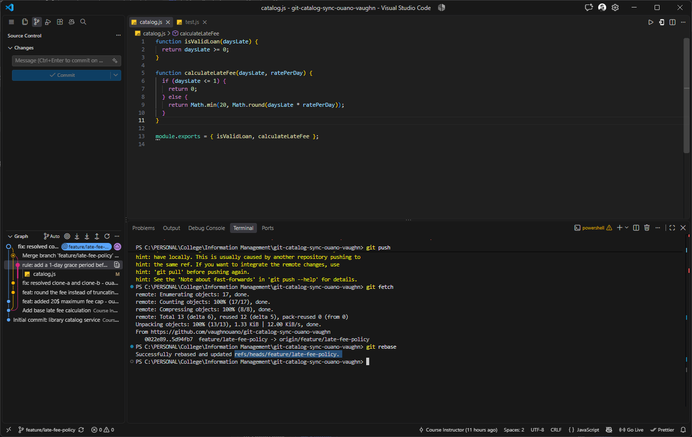
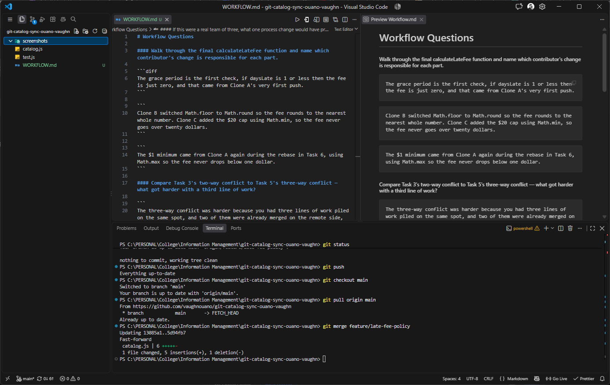

# Workflow Questions

#### Walk through the final calculateLateFee function and name which contributor's change is responsible for each part.

```diff
The grace period is the first check, if daysLate is 1 or less then the fee is just zero, and that came from Clone A's very first push.
```

```
Clone B switched Math.floor to Math.round so the fee rounds to the nearest whole number. Clone C added the $20 cap using Math.min, so the fee never goes over twenty dollars.
```

```
The $1 minimum came from Clone A again during the rebase in Task 6, using Math.max so the fee never drops below one dollar.
```

#### Compare Task 3's two-way conflict to Task 5's three-way conflict — what got harder with a third line of work?

```
The three-way conflict was harder because you had three lines of work piled on the same spot, and two of them were already merged on the remote side, so the incoming side was a composite you had to reason about all at once.
```

```
The two-way was simpler since you only compared two blocks and picked the right lines. With three contributors the number of ways things could break multiplies, so you spend more time figuring out what the code should do before you can even resolve it.
```

#### What's the actual difference between how you resolved Task 5 (merge) and Task 6 (rebase)?

```
The difference is between how it handles the commits. Merge combines two branches by creating a new commit that connects branche's histories/log together.
```

```
Rebase takes the commit and replays them on top of another branch, making the history/log looks like straight line.
```

#### If this were a real team of three, what one process change would have prevented all three rejected pushes?

```
Require everyone to pull the latest from the shared branch before starting any new work, and again before pushing.
```

## TASKS

### Task-01



### Task-02



### Task-03



### Task-04



### Task-05



### Task-06



### Task-07


